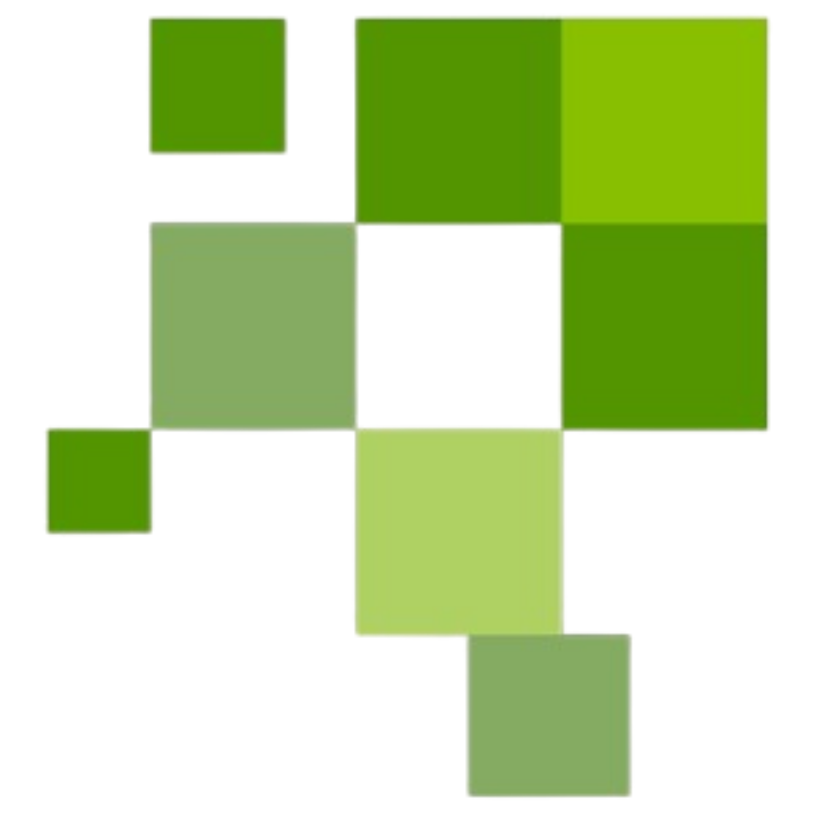
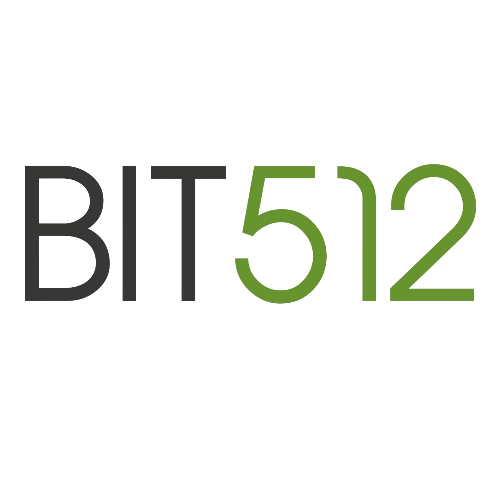

 

  

### Technology & Innovation Studio

**Software Development | AI Solutions | Cloud Architecture**

---

## About Us

We are a technology studio specializing in **enterprise software development**, **AI-driven solutions**, and **cloud architecture**. We build scalable platforms that solve real business problems — from concept to production.

Our approach combines modern tech stacks with solid engineering practices: monorepo architecture, strict TypeScript, automated CI/CD, and security-first design.

## What We Build

- **Enterprise HCM Platforms** — Full lifecycle human capital management (recruitment, onboarding, evaluations, compensation)
- **AI-Powered Applications** — LLM integration, document analysis, intelligent assistants, and automated scoring
- **SaaS Products** — Multi-tenant platforms with role-based access, audit trails, and real-time dashboards
- **Data Pipelines** — ETL systems, real-time scraping, and analytics at scale

## Tech Stack

## Active Projects

| Project | Description | Stack |
|---------|-------------|-------|
| **HCM Compensar** | Enterprise Human Capital Management platform for Compensar. Full recruitment lifecycle, AI-powered candidate scoring, and real-time dashboards. | Next.js 15, React 19, Prisma 6, Azure OpenAI, AKS |
| **Janus** | Intelligent data platform with real-time processing and automated workflows. | TypeScript, Python, Celery |
| **Nexus** | Business management platform for internal operations. | TypeScript |

## Engineering Practices

- **Monorepo Architecture** — Turborepo + pnpm workspaces for shared code across apps and packages
- **TypeScript Strict** — Zero `any` tolerance, full type safety from DB to UI
- **Security First** — RBAC, HMAC-signed sessions, CSP headers, rate limiting, input validation
- **CI/CD** — GitHub Actions with automated lint, typecheck, build, and deploy to Azure AKS
- **Code Quality** — SonarQube analysis, ESLint security scanning, automated dependency audits

## Team

| Role | Focus |
|------|-------|
| **Deiby Ariza** — Lead Engineer | Architecture, AI integration, security, DevOps |
| **Frontend Team** | React components, UX, accessibility |
| **Backend Team** | APIs, database design, integrations |

---

**BIT512** — Building technology that matters.

*Bogota, Colombia*

